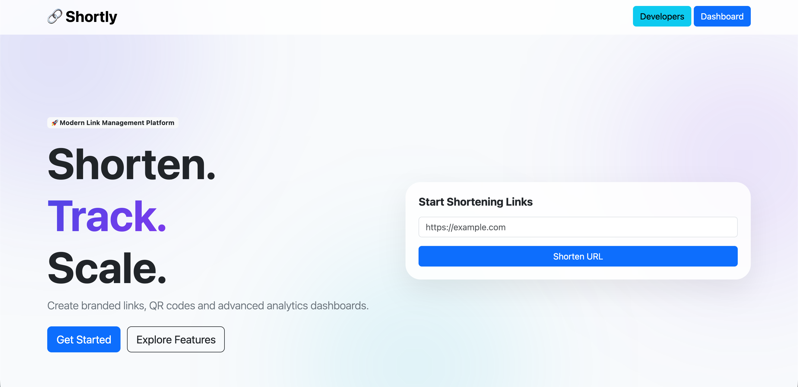
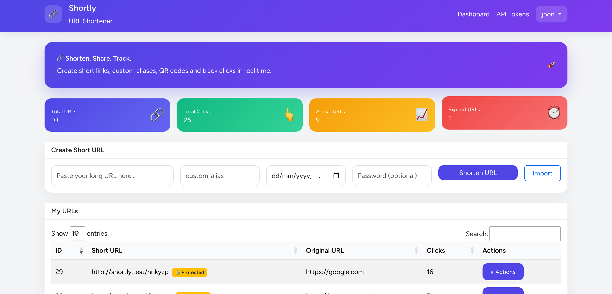
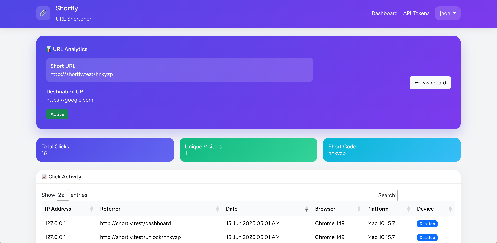
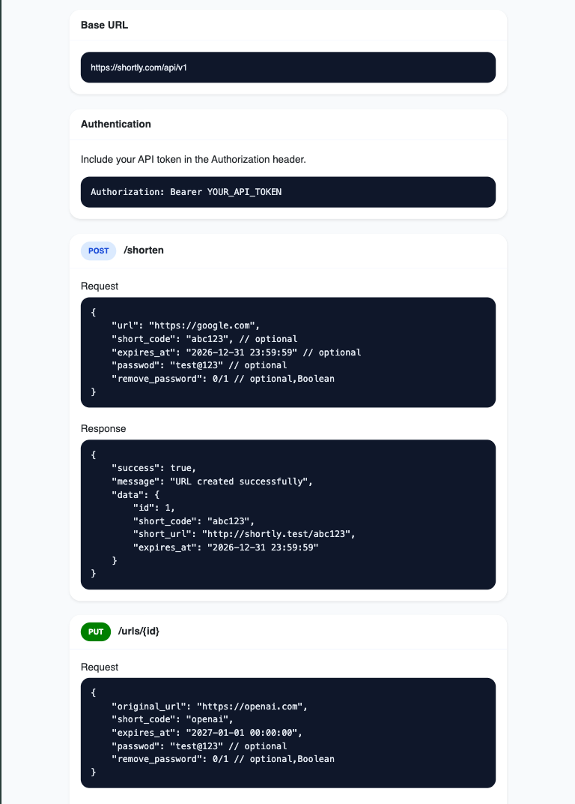
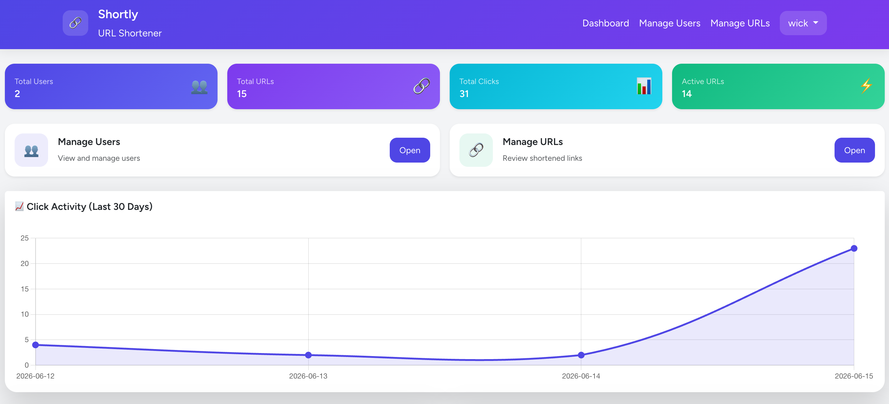
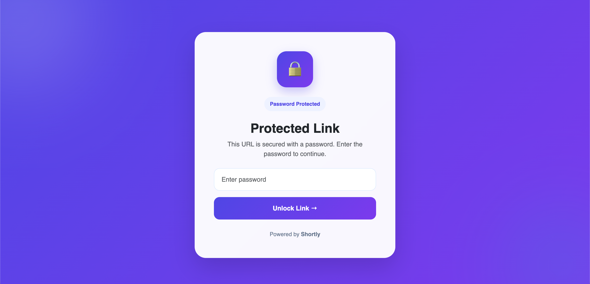

# Shortly 🚀

A modern URL shortening platform built with Laravel 12 that allows users to create, manage, secure, and analyze shortened URLs through a powerful dashboard and REST API.

---

## ✨ Features

### User Features

* Create short URLs
* Custom URL aliases
* URL expiration dates
* Password-protected links
* QR code generation
* Link editing
* URL analytics and click tracking
* Bulk URL import (CSV/XLSX)

### Developer Features

* REST API
* Laravel Sanctum API authentication
* Personal API tokens
* API rate limiting
* Developer documentation portal
* API analytics endpoints

### Admin Features

* Admin dashboard
* User management
* URL management
* Global analytics
* User suspension system

---

## 📸 Screenshots

### Landing Page



### User Dashboard



### Analytics



### API Documentation



### Admin Dashboard



### Password Protected Links



---

## 🛠 Tech Stack

### Backend

* Laravel 12
* PHP 8.4
* MySQL
* Laravel Sanctum

### Frontend

* Bootstrap 5
* JavaScript
* DataTables

### Packages

* Yajra DataTables
* Laravel Excel
* Simple QR Code
* Laravel Sanctum

---

## 🔐 Authentication

Shortly supports:

* User Registration
* Login / Logout
* Password Reset
* Email Verification
* API Token Authentication

---

## 📊 Analytics

Track detailed URL performance:

* Total Clicks
* Unique Visitors
* Browser Information
* Device Type
* Platform Information
* Click History

---

## 🔒 Password Protected Links

Protect sensitive links with a password.

Features:

* Password verification page
* Session-based unlocking
* Password invalidation after updates
* Remove protection anytime

---

## 📦 Bulk Import

Import hundreds of URLs at once.

Supported formats:

* CSV
* XLSX
* XLS

Template download included.

---

## 🔌 REST API

### Authentication

Generate API tokens from:

Dashboard → API Tokens

Include the token in requests:

```http
Authorization: Bearer YOUR_API_TOKEN
```

### Available Endpoints

#### Create Short URL

```http
POST /api/v1/shorten
```

#### List URLs

```http
GET /api/v1/urls
```

#### Update URL

```http
PUT /api/v1/urls/{id}
```

#### Delete URL

```http
DELETE /api/v1/urls/{id}
```

#### URL Analytics

```http
GET /api/v1/urls/{id}/analytics
```

#### Click Logs

```http
GET /api/v1/urls/{id}/clicks
```

---

## 🚀 Installation

Clone the repository:

```bash
git clone https://github.com/your-username/shortly.git
```

Move into project directory:

```bash
cd shortly
```

Install dependencies:

```bash
composer install
```

```bash
npm install
```

Create environment file:

```bash
cp .env.example .env
```

Generate application key:

```bash
php artisan key:generate
```

Configure your database and run migrations:

```bash
php artisan migrate
```

Build assets:

```bash
npm run build
```

Start development server:

```bash
php artisan serve
```

Application will be available at:

```text
http://localhost:8000
```

---

## 📁 Project Structure

```text
app/
├── Http/
├── Models/
├── Services/
├── Imports/
├── Exports/

resources/
├── views/

routes/
├── web.php
├── api.php
```

---

## 🔮 Future Improvements

* Custom Domains
* Team Workspaces
* Advanced Geo Analytics
* Link Scheduling
* Webhooks
* Public API SDK

---

## 👨‍💻 Author

Neeraj Sharma

Laravel Developer

GitHub: https://github.com/neerajksha

LinkedIn: linkedin.com/in/neerajsharma-dev

---

## 📄 License

This project is open-source and available under the MIT License.
